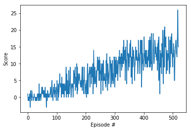

# Project report

## DQN network architecture
As the input to the network is simply a 37 dimensional vector and there is no spatial or temporal relation between it.
There is no point in CNNs. Thus we have used a simple four layer feedforward network with the following layer details.

(FC layer input: 37  Output: 128),
(FC layer input: 128  Output: 64)
(FC layer input: 64  Output: 32)
(FC layer input: 32  Output: action_size)

The first three layers have been applied relu activation

- Max Steps for training: 1000
- Epsilion Value (so that at the beginning it is exploring): 1.0
- Least epsilion value (minimum value so that it doesn't completely exploit): 0.01
- Decay rate of epsilion (so that exploration changes to exploitation): 0.995

## Results



```
Episode 100	Average Score: 0.67
Episode 200	Average Score: 3.88
Episode 300	Average Score: 6.98
Episode 400	Average Score: 11.02
Episode 500	Average Score: 12.54
Episode 520	Average Score: 13.00
Environment solved in 420 episodes!	Average Score: 13.00
```

## Ideas for future work

1. Extensive hyperparameter optimization
2. Double Deep Q Networks
3. Prioritized Experience Replay
4. Dueling Deep Q Networks
5. RAINBOW Paper
6. Learning from pixels
